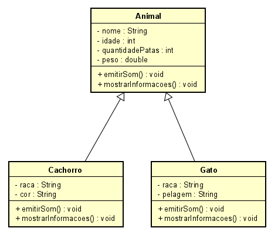

# 📝 Dia 9: Conceitos de Programação Orientada a Objetos em Java - Herança, Construtores e Anotação `@Override`

No nono dia do desafio, foquei em estudar Herança, Construtores e Anotação `@Override` derivados de POO.

## 🧠 Conceitos Revisados

Durante este dia, revisei os seguintes conceitos:

### ✍🏻 Herança em Java
Em Java, o conceito de herança permite que uma classe herde atributos e métodos de outra classe, chamada de classe base ou superclasse. A classe que herda é chamada de classe derivada, subclasse ou filha.

No Java, a herança é implementada usando a palavra-chave `extends`. A sintaxe básica é a seguinte:
```java
class Superclasse {
    // Atributos e métodos da superclasse
}

class Subclasse extends Superclasse {
    // Atributos e métodos específicos da subclasse
}
```
Herança permite:
- Reutilizar código comum em várias classes.
- Criar uma estrutura hierárquica de classes.
- Sobrescrever métodos da superclasse na subclasse para fornecer uma implementação específica.
  
### ✍🏻 Construtores em Java
Construtores são métodos especiais usados para inicializar objetos. Existem dois tipos principais de construtores:

1. **Construtor não parametrizado (default):**
- Não recebe parâmetros.
- É fornecido automaticamente pelo compilador se nenhum construtor for definido.
```java
class Exemplo {
    public Exemplo() {
        // Código de inicialização
    }
}
```

2. **Construtor parametrizado:**
- Recebe parâmetros para inicializar atributos específicos do objeto.
```java
class Exemplo {
    private String atributo;

    public Exemplo(String atributo) {
        this.atributo = atributo;
    }
}
```
Quando uma classe herda outra classe, o construtor da superclasse é chamado automaticamente antes do construtor da subclasse. Isso garante que os atributos da superclasse sejam inicializados corretamente.

### ✍🏻  Anotação `@Override` em Java
A anotação `@Override` é usada para indicar que um método em uma subclasse está sobrescrevendo um método na superclasse. Ela melhora a legibilidade do código e ajuda o compilador a detectar erros se a assinatura do método não corresponder exatamente ao método na superclasse.
```java
class Superclasse {
    public void metodo() {
        System.out.println("Método da superclasse");
    }
}

class Subclasse extends Superclasse {
    @Override
    public void metodo() {
        System.out.println("Método sobrescrito na subclasse");
    }
}
```
### 📊 Diagrama de Classes
**🧩 O que é um Diagrama de Classes?**
- Um diagrama de classes é uma representação visual das classes em um sistema de software e os relacionamentos entre elas. É uma das principais ferramentas utilizadas na modelagem de sistemas orientados a objetos e faz parte da UML (Unified Modeling Language). Os diagramas de classes ajudam a ilustrar a estrutura de um sistema, mostrando:

    - **Classes:** Representadas como caixas contendo o nome da classe, atributos e métodos.
    - **Relacionamentos:** Linhas que conectam as classes, mostrando heranças, associações e outras relações.
      
**🧩 Exemplos Práticos Implementados:**
- ***Projeto sobre animais:**
Este projeto ilustra uma hierarquia de classes para animais, mostrando como atributos e métodos podem ser herdados de uma superclasse. Neste projeto abordamos:
    - Implementação de Classes (superclasses e subclasses)
    - Encapsulamento
    - Métodos do tipo Void (Anotação `@Override`)
    - Herança
> Acesse o projeto em: [AnimalsProjectHierarchy](Project/Day09/AnimalsProjectHierarchy)
<p align="center"></p>

- ***Projeto sobre Veiculo:***
Neste projeto, a hierarquia de classes de veículos demonstra como diferentes tipos de veículos podem compartilhar atributos comuns e métodos, mas também ter suas próprias características específicas.Neste projeto abordamos:
    - Implementação de Classes (superclasses e subclasses)
    - Encapsulamento
    - Métodos do tipo Void (Anotação `@Override`)
    - Herança
    - Métodos Construtores
> Acesse o projeto em: [VeiculoProjectHierarchyConstructor](Project/Day09/VeiculoProjectHierarchyConstructor)
<p align="center"></p>

##

> Esses exemplos práticos fornecem uma visão clara de como utilizar herança, encapsulamento e construtores em Java, além de ilustrar como organizar e visualizar essas relações em diagramas de classes UML. Isso ajuda a entender melhor a estrutura e o funcionamento interno dos sistemas orientados a objetos.
